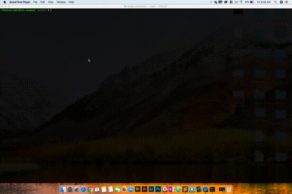

# Bamazon

This is an interactive shopping node app using Mysql and Node.js. Where the user can buy item by its item id. The user will be asked of the quantity of the item that he/she wants to purchase.
## Screen Shot




## Getting Started

These instructions will get you a copy of the project up and running on your local machine for development and testing purposes. See deployment for notes on how to deploy the project on a live system.

### Prerequisites
Please intall the following packages.
Please refer to https://docs.npmjs.com/cli/install for how to's.

```
* npm install cli-table
* npm install inquirer
* npm install mysql
```

### Installing
package.json is included, just type the code below.

```
npm install
```


## Deployment

```
Github
```
## Technologies used

* node.js
* JavaScript
* mySql
* cli-table
* inquirer


## Authors

Robinson Garcia


